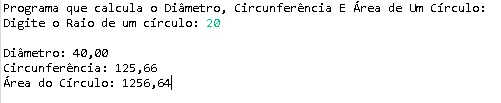

# Diâmetro, Circunferência e Área De Um Círculo Em Java

**Diâmetro, Circunferência e Área De Um Círculo Em Java**

Autor: Erick Leite Freire 
Criado em: 25-08-2024 
Site: [Erick Freire](https://www.erickfreire.com.br) 
